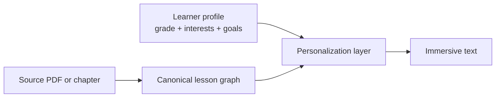

# 01 — Architecture

## Two-stage pipeline

Stage 1 is personalization. Stage 2 is content generation. The personalized
lesson graph is transformed into immersive text tailored to the learner's
grade level and interests.

## Layers

The implementation is layered. Each layer has explicit inputs and
outputs and can be tested independently.

### 1. Ingest and parsing

Input: source PDF (or other supported format).
Output: a `ParsedDocument` with chunks, page offsets, character
offsets, and any extracted figures or tables.

Implementation: Docling.

### 2. Canonical lesson graph

Input: `ParsedDocument`.
Output: a graph of `ConceptNode` instances, each with one or more
`SourceSpan` references back into the parsed document.

The lesson graph is the single source of truth for everything
downstream. Schema lives in `src/lesson_graph/models.py`. See
`docs/02-data-model.md` for rationale.

### 3. Personalization layer

Input: lesson graph plus learner profile (grade level, interests,
goals).
Output: a personalized projection of the lesson graph in which:

- Text has been re-leveled to target readability.
- Generic examples have been selectively replaced with examples tied
  to the learner's interests.
- Every change is diffable against the source.

The personalization layer never invents content not anchored to a
`SourceSpan`.

### 4. Retrieval and grounding

Input: a query (from the user, from a generator, or from the gap
detector).
Output: ranked source chunks with exact span references.

Implementation: hybrid retrieval — BM25 (Haystack
`InMemoryBM25Retriever`) plus dense vectors (Qdrant) plus a
cross-encoder reranker. The retriever serves both interactive queries
and the generation pipelines.

### 5. Content generation

The immersive text generator consumes the personalized lesson graph and
produces an `ImmersiveText` asset that records the concepts and source
spans it was based on. The generator has a validator that runs before the
asset is persisted. A generated asset that fails validation is rejected,
not patched.

## Orchestration

Modality generation is asynchronous. Interactive paths (quiz feedback,
guided hints) use a synchronous code path. Stable assets are
precomputed at ingest time; expensive variants are generated as
background jobs against the Arq queue.

## Deployment shape

Single process (or small docker compose). Components:

- **App process**: FastAPI server.
- **Worker process**: Arq worker handling background generation jobs.
- **Qdrant**: vector store, runs as a Docker container.
- **Redis**: backing store for Arq, runs as a Docker container.
- **SQLite**: lesson metadata and assessment history. File-based, no
  separate process.
- **Local filesystem**: source PDFs and derived assets, under a
  configurable data directory.

The first-party API surface is documented in `docs/04-api.md`.
