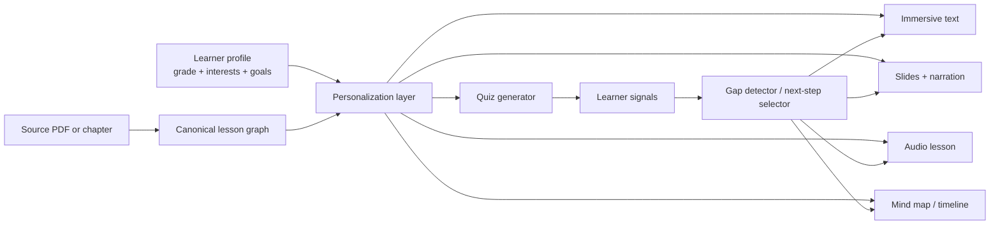

# Building an Open-Source Alternative to Google's Learn Your Way

> **Note:** This is the original research document preserved verbatim
> for reference. The working specs in `specs/` and the design docs in
> `docs/` supersede this document when they conflict. Do not edit this
> file; treat it as a fixed input.

## Executive Summary

The most important finding is that Learn Your Way is not just a
"document-to-podcast" or "PDF-to-mindmap" product. Its distinctive
design is a two-stage pedagogical transformation pipeline: first, source
text is adapted to the learner's grade level and interests; then that
personalized text becomes the basis for multiple learning
representations and embedded assessment. Google's public materials
consistently frame this as the core invention, not as a generic chatbot
workflow.

Publicly disclosed features are stronger on learning design than on
classical recommendation infrastructure. Google describes immersive
text, embedded questions, section quizzes, narrated slides, audio
lessons, mind maps, timelines, and mnemonics; it also says quiz feedback
guides learners back to weak areas. But the public record does not
disclose a dedicated recommender engine, a collaborative-filtering
stack, a formal knowledge graph, a storage schema, or a production
service topology. The personalization that is actually visible today is
mostly explicit-profile plus assessment-feedback adaptation.

The enabling model family behind the experience is LearnLM, developed
across Google Research, Google DeepMind, and related teams. Google's
LearnLM technical report says the work is framed as pedagogical
instruction following, trained via supervised fine-tuning plus RLHF, and
co-trained with Gemini's post-training stages so that pedagogical
behavior can be invoked through system instructions rather than
per-product fine-tuning. That is a major clue for an open-source
replacement: the fastest path is not to train a giant proprietary tutor
from scratch, but to combine a strong base model with carefully designed
pedagogical system prompts, evaluation rubrics, and a workflow layer.

Google's own adjacent products confirm the broader pattern. Learn About
focuses on conversational exploration with pictures, videos, webpages,
and activities; Guided Learning in Gemini emphasizes Socratic
questioning, multimodal explanations, and interactive quizzes;
NotebookLM focuses on source-grounded transformations such as mind maps,
audio overviews, and video overviews; Gemini LTI embeds these
capabilities inside LMS environments, with support documented for
Canvas by Instructure and Schoology Learning by PowerSchool. Together,
these initiatives make it clear that an open-source alternative should
be built as a modular learning platform, not as a single monolithic
tutor.

The best open-source strategy is therefore a layered stack: document
parsing and grounding, a canonical lesson graph, explicit user-profile
controls, hybrid retrieval plus reranking for grounded generation,
modality-specific generators, assessment loops, and strong
privacy/policy controls. The first release should avoid flashy
overreach. In particular, Google explicitly reports that
general-purpose image models were not good enough for educational
visuals and that it had to fine-tune a dedicated illustration model.
Any open-source clone that ignores this will ship pretty but
pedagogically weak diagrams.

## What the public record actually shows

Google publicly describes Learn Your Way as a research experiment on
Google Labs that "re-imagines textbooks for every learner," with a
waitlist for uploading your own PDF and public sample experiences. The
positioning is explicitly about turning static educational materials
into a dynamic, personalized, multimodal learning experience rather
than replacing teachers or replacing curriculum.

The core primary sources are unusually useful, but they stop at the
pedagogy-and-pipeline layer. The Google Research post and the associated
tech report explain the two-stage system, the modality inventory, and
the evaluation design in enough detail to reverse-engineer a credible
open implementation. By contrast, details such as data schemas,
internal storage, exact moderation policies for Learn Your Way itself,
and the serving architecture are not publicly documented in the sources
reviewed here. That gap matters, because it means any open-source
alternative will necessarily involve explicit design choices rather than
simple cloning.

### Source map

| Primary source | High-confidence disclosures | Why it matters for an open alternative |
| --- | --- | --- |
| Google Research post + Learn Your Way tech report | Product goals, two-stage pipeline, feature set, pedagogical rationale, expert evaluation, and the randomized study against a digital reader. | This is the single best blueprint for reproducing the product at the workflow level. |
| LearnLM technical report + LearnLM Cloud page | Pedagogical instruction following, co-training with Gemini post-training stages, RLHF, scenario-based evaluation, and the five learning-science principles. | Explains how Google likely got the tutoring behavior without building a separate model for every feature. |
| Guided Learning, Learn About, NotebookLM product posts | Related UX patterns: Socratic questioning, multimodal responses, source-grounded summaries, mind maps, audio/video overviews, and conversational exploration. | Shows which interaction patterns Google is standardizing across products. |
| Gemini LTI and education help docs | LMS embedding, admin enablement, student/teacher contexts, Canvas/Schoology support, and feature exposure inside the LMS. | Useful if the open alternative needs institutional deployment rather than a standalone app. |
| NotebookLM privacy/help docs and education privacy FAQs | Data handling patterns for adjacent education products: source-grounding, no direct model training for certain Workspace/Education contexts, human review limits, and service-specific terms. | Best available proxy for how an institution-grade version should handle privacy and consent. |
| Patent sources | Related patent landscape around adaptive instructional flow, question-driven learning maps, personalized summaries, content transformation, and query generation. | Critical for commercial risk assessment and design-around strategy. |

## Product goals and interaction model

Google's stated goal is to preserve the integrity of source material
while transforming one-size-fits-all textbooks into learner-driven
experiences with multiple representations and initial forms of
personalization. The public UX starts by asking for grade level and
interests such as sports, music, or food. Google then re-levels the
text to match the target grade, strategically replaces generic examples
with relatable examples tied to the learner's interests, and uses that
transformed text as the basis for downstream modalities.

The disclosed feature surface is broader than many summaries suggest.
The headline modes are immersive text, section-level quizzes, slides
with optional narration, an audio lesson, and mind maps. But the tech
report also describes timelines, mnemonic "memory aids," generated
illustrations, embedded multiple-choice questions, and section quizzes
with 5–10 questions plus "Glows" and "Grows" feedback. That means a
serious clone has to support far more than chat plus TTS.

A crucial design point is that the modes are not independent products.
Google says the downstream representations are generated from the
personalized text, so the system has a canonical intermediate
representation even if Google does not publish the schema. This is
exactly the right design. An open-source implementation should not let
each modality improvise separately over the raw PDF, because that will
drift semantically and break alignment across views.

The user flow is also telling. The interface exposes multiple
representations side by side and uses quizzes to steer learners back
toward weak sections. That is closer to a guided study environment than
to a chatbot. Google's study participants were trained briefly on tool
features, then explored content for 20–40 minutes before assessment.
That implies the product is designed for a session model with modality
switching, not a single-turn Q&A flow.



The diagram above is a recommended architecture, not a Google diagram.
It is inferred from Google's public description that personalization
happens first, multiple modalities are generated second, and assessment
signals feed back into guidance.

## System architecture, data, and ML

Google's public architecture description is specific in three places.
First, the pipeline is two stage: personalization, then content
transformations. Second, some modalities use Gemini "directly," while
others require multi-step agentic workflows with specialized tools.
Third, educational illustrations were hard enough that Google fine-tuned
a dedicated model for that task. Those three facts strongly imply an
orchestration layer with structured intermediate outputs, not a single
monolithic prompt.

LearnLM fills in the missing model-level picture. Google says LearnLM
was trained for pedagogical instruction following by seeding
conversations with explicit system instructions, augmenting supervised
fine-tuning with human-preference data and reward models, and
co-training with Gemini's broader post-training recipe so pedagogical
behaviors could be invoked via prompts without sacrificing general
reasoning, safety, or multimodal capacity. For an open implementation,
that points to a practical recipe: start with a strong long-context
multimodal base model, then add pedagogical system prompts, rubrics,
and preference data before attempting expensive domain-specific
fine-tuning.

### What Google discloses versus what should be built

| Problem area | What Google publicly discloses | Best interpretation | What to build openly |
| --- | --- | --- | --- |
| Personalization | Grade-level re-leveling, interest-based example replacement, and quiz-driven revisits. | Mostly explicit-profile personalization, not collaborative filtering. | Start with explicit controls and quiz feedback. Add contextual bandits later only if you can justify the privacy tradeoff. |
| Search and grounding | Source-of-truth PDFs and grounded questions tied to sections. | This is document-grounded generation, not open-web search. | Use hybrid retrieval over parsed chunks plus exact source-span tracking and citations. |
| Ranking | No dedicated ranking stack is disclosed. | Likely prompt-time selection and simple UI ordering. | Use BM25 + dense retrieval + reranker for grounded snippets; use lightweight sequencing models for lesson-order suggestions. |
| Content classification | Google mentions scanning source material for candidate sequences and illustration-worthy spans; broader moderation specifics are not disclosed for Learn Your Way itself. | There are task classifiers inside the workflow, but they are not fully described. | Add explicit classifiers for sequence detection, concept extraction, quizability, PII, safety, and image-worthiness. |
| Multimodal generation | Gemini direct generation, agentic pipelines, independent teacher/student personas for audio lessons, and a fine-tuned illustration model. | A workflow graph around one or more base models. | Build separate generators for each modality with a shared lesson graph and modality-specific validators. |

The data model Google does not publish is more important than the exact
prompts Google likely used. The right canonical structure for an
open-source version is a lesson graph with explicit provenance. Each
node should correspond to a source-backed concept or section; each
derived asset should record the source spans it came from; every quiz
item should point back to the learning objective and source evidence it
assesses. If that sounds boring compared with "AI magic," good. Boring
is exactly what makes these systems auditable.

```python
from pydantic import BaseModel
from typing import List, Literal, Optional

class SourceSpan(BaseModel):
    doc_id: str
    page_start: int
    page_end: int
    char_start: int
    char_end: int

class ConceptNode(BaseModel):
    id: str
    title: str
    summary: str
    learning_objective: str
    source_spans: List[SourceSpan]
    prerequisites: List[str] = []

class AssessmentItem(BaseModel):
    id: str
    kind: Literal["mcq", "matching", "short_answer", "drag_drop_timeline"]
    prompt: str
    rationale: str
    source_spans: List[SourceSpan]
    difficulty: Literal["easy", "medium", "hard"]

class DerivedAsset(BaseModel):
    id: str
    kind: Literal["immersive_text", "slides", "audio_lesson", "mind_map",
                  "timeline", "image"]
    based_on_concepts: List[str]
    personalization_profile: dict
    uri: Optional[str] = None
```

That schema is a recommendation. Google's public materials justify the
need for it because they repeatedly emphasize source faithfulness,
coverage, emphasis, adaptability, active learning, and clarity of
learning intentions in their pedagogy rubrics.

## Privacy, security, APIs, and legal constraints

Privacy is one of the weakest areas of public disclosure for Learn Your
Way specifically. Google clearly says Learn Your Way is a Labs
experiment, but the sources gathered here do not expose a dedicated
Learn Your Way retention policy or a separate public API. That means an
open-source alternative should not assume Google has solved
institutional compliance for this product surface; it should instead
copy the stricter patterns from adjacent education tools.

Those adjacent patterns are reasonably clear. NotebookLM's help
documentation says the files you add, outputs you generate, and chat
history are used to build the notebook knowledge base; it also says
content is not used to directly train foundational AI models unless you
choose to provide feedback, and that Google Workspace or Education
accounts get stronger protections, including no human review and no
training use for uploads, queries, and outputs. Education privacy FAQs
say Gemini and NotebookLM are Core Services under Google Workspace for
Education and are not reviewed by humans or used to improve generative
AI models in that context.

The integration story is clearer than the Learn Your Way API story.
Gemini LTI is documented as an LMS surface for centralized access to
Google AI tools within Canvas and Schoology Learning, with admin
enablement required for Workspace LTI, Gemini, and NotebookLM services.
Public materials also describe Learn About, NotebookLM, and Illuminate
as products tied into this broader education stack. That is a strong
signal that an open-source alternative should support LTI from day one
if schools matter. Avoid building a consumer-only toy that cannot
survive real institutional deployment.

The patent landscape is real, and it should not be hand-waved away. No
patent explicitly naming "Learn Your Way" or "LearnLM" surfaced in this
research, but several related patents matter. A Google patent on
dynamic instructional courses describes customizing course segments
based on user inputs and multiple content formats; a patent on
inquiry-driven learning describes course maps made of interconnected
content nodes and question-driven navigation; a Google patent on
personalized summaries covers generating summaries based on user
profiles and modalities; Google's query-generation patent covers
synthetic prompt/query generation for retrieval; and a third-party
patent on automated question generation describes staged semantic
processing for higher-order educational questions. None of this makes
an open-source clone impossible, but a commercial product needs counsel
and a clear design-around strategy.

Licensing is similarly nontrivial. Google used materials from OpenStax
in evaluation, and the public OpenStax licensing materials describe
textbook reuse under Creative Commons terms that permit adaptation with
attribution and additional license conditions depending on the content
set. Google's LearnLM partner prompt guide is explicitly CC BY 4.0,
which makes its prompt-structuring advice reusable; however, adjacent
Google products and older model releases do not all use the same
licensing model. Notably, Google's more recent Gemma 4 release is
described under an Apache 2.0 open-source license, whereas earlier
Gemma releases were subject to custom terms of use. Use the newer,
cleaner license if you want the fewest downstream headaches.

## Open-source reference stack

A credible open-source alternative can be assembled today. The right
question is not "what single repo replaces Learn Your Way?" There is no
such repo. The right question is "which components replace each
disclosed capability with acceptable legal and operational tradeoffs?"

### Feature-to-stack mapping

| Capability to replicate | Strong open choice | Why it fits |
| --- | --- | --- |
| Base instructional model | Gemma 4, which Google describes as open models under Apache 2.0, with multimodal support and long context. | Best if you want a Google-adjacent foundation with a permissive license. |
| Document parsing and PDF understanding | Docling, an MIT-licensed toolkit for parsing diverse documents and advanced PDF understanding. | Directly addresses the ingest problem that Learn Your Way starts from. |
| Pipeline orchestration | Haystack, Apache 2.0, with modular pipelines, routing, retrieval, and multimodal RAG patterns. | Good fit for multi-stage modality generation and evaluation loops. |
| Real-time retrieval and recommendation serving | Vespa, Apache 2.0, explicitly positioned for search plus real-time recommendation and personalization. | Strongest all-in-one serving layer if you need ranking and personalization online. |
| Search and analytics backend | OpenSearch, Apache 2.0. | Good if the team already knows Elasticsearch-like stacks. |
| Research-grade sparse/dense retrieval | Pyserini, Apache 2.0, with Lucene and Faiss integrations. | Excellent for offline IR experiments and baseline retrieval evaluation. |
| Vector store | Qdrant (Apache 2.0) or Weaviate (BSD-3). | Both are reasonable; choose based on operational preferences, not hype. |
| Recommendation algorithms | RecBole, MIT, with dozens of recommendation algorithms across general, sequential, context-aware, and knowledge-based settings. | Useful if and only if you later add real recommendation experiments. Do not start here. |
| PII de-identification | Presidio, MIT, for identifying and anonymizing sensitive entities in text. | Essential for school deployments, logs, and analytics pipelines. |
| Policy enforcement | Open Policy Agent, Apache 2.0. | Use for consent gates, teacher controls, feature flags, and data-sharing policy. |
| Differential privacy tooling | TensorFlow Privacy, Apache 2.0. | Useful if you later train on learner telemetry or personal data. |
| Safety moderation | ShieldGemma / ShieldGemma 2 for text and image safety classification. | Helpful if you want a Google-published open-weight moderation layer. |
| Mind-map and graph UI | Mermaid and Cytoscape.js, both MIT for core usage. | Mermaid is faster for generated diagrams; Cytoscape.js is better for interactive concept graphs. |
| TTS for audio lessons | Piper, MIT in the archived repo, with a newer GPL successor. | Good local TTS, but the licensing transition needs explicit review. |
| LMS / institutional platform | Open edX (AGPL) or Moodle (GPL-3.0). | Choose based on whether you want a full LMS or a companion app with LTI. |

The licensing lesson is blunt: if the product is meant to be
commercially hosted, favor the permissive infrastructure pieces first
and be deliberate about copyleft at the platform layer. An AGPL LMS
plus a permissively licensed AI backend is viable, but only if the
business wants to live with AGPL obligations. If it does not, do not
accidentally back into that architecture.

## Concrete implementation blueprint

The fastest credible build is a three-phase program, not a moonshot.

### Phase one

Build an ingest-and-ground layer. Parse PDFs with Docling, create a
canonical lesson graph, store chunks with exact source spans, and
expose a reviewer UI so educators can inspect section boundaries,
extracted concepts, and learning objectives before any generation runs.
That is the foundation Google's public write-up implies even though it
does not publish the schema.

### Phase two

Implement text personalization and assessment before you touch fancy
media. Re-level text to target readability, replace only clearly
"personalizable" examples, and keep every change diffable against
source. Then add embedded questions and section quizzes with rationale
and source citation. This is where most of the pedagogical value lives,
and it is also where the public evidence is strongest.

### Phase three

Add modality generators one by one: narrated slides, then mind
maps/timelines, then audio lessons. Do **not** start with illustration
generation unless you have a verifier layer. Google already did the
experiment for everyone and concluded generic image generation was not
reliable enough for educational visuals. Ignore that finding and the
system will look impressive in demos while quietly failing the teacher.

### Recommended deployment shape

Use object storage for originals and derived assets, a relational store
for canonical lesson metadata and permissions, a vector/text index for
retrieval, a queue for background generation, GPU workers for heavy
multimodal jobs, and a separate low-latency inference path for quiz
feedback and guided hints. Precompute stable assets at ingest time and
generate expensive variants asynchronously. That is the only sane way
to control latency and cost once audio and slide generation enter the
picture. This is a design recommendation based on Google's multi-step
pipeline disclosures and on the general capabilities of the relevant
open tooling.

A minimal first-party API surface should include:

- `POST /sources` for upload and parse.
- `POST /profiles` for explicit learner settings.
- `POST /lessons/{id}/generate` for modality jobs.
- `GET /lessons/{id}` for canonical lesson graph retrieval.
- `POST /attempts` for quiz events and telemetry.
- `POST /recommendations/next` for weak-skill guidance.
- `GET /audit/{asset_id}` for provenance, source spans, and moderation
  traces.

That API is not copied from Google; it is what the public evidence
practically demands if the goal is a system that stays grounded,
reviewable, and extensible.

## Gaps, improvements, and open questions

The biggest gap in Google's public disclosure is not model performance.
It is operational specificity. The sources reviewed here do not say how
Learn Your Way stores its canonical content state, how it versions
generated assets, how it handles abuse reporting and moderation at the
experiment layer, or whether it exposes institution-grade controls
comparable to adjacent Workspace for Education products.

That gap creates an opportunity. An open-source alternative can beat
the public Google experiment by being more explicit and more
trustworthy. The most valuable improvements would be source-span
citations on every generated sentence, teacher-editable lesson graphs,
asset versioning, deterministic quiz review, strong consent controls,
opt-in telemetry only, and institution-visible audit logs. Google's
public story is stronger on pedagogy than on inspectability; an open
system can flip that.

The hardest feature to replicate faithfully is the combination of
pedagogical instruction following plus multimodal polish. LearnLM's
behavior is not just "a good base model." It is the result of training,
reward modeling, evaluation scenarios, and prompt design centered on
active learning, cognitive load, metacognition, curiosity, and learner
adaptation. If the open substitute skips evaluation and goes straight
to prompt engineering, it will produce a flashy demo, not a serious
learning product.

### Open questions and limitations

- No public source reviewed here exposed a dedicated Learn Your Way
  API, storage schema, or infrastructure diagram.
- No public source reviewed here surfaced a patent explicitly naming
  Learn Your Way or LearnLM; the patent section therefore focuses on
  related prior art, not a named-product filing.
- Learn Your Way-specific privacy and retention terms were not publicly
  documented in the gathered materials, so the privacy analysis relies
  partly on adjacent Google education products rather than on a
  product-specific policy.

The bottom line is straightforward. The open-source alternative should
copy the pedagogical structure, not the branding surface. Build a
source-preserving lesson graph, explicit-profile personalization,
quiz-driven adaptation, modality-specific generators, and institutional
controls. That gets most of the value with far less mystery. The rest —
especially educational illustrations, deep pedagogy alignment, and safe
large-scale deployment — is where the real work starts.

## Citations from the original document

- Learn Your Way: Reimagining textbooks with generative AI — `https://research.google/blog/learn-your-way-reimagining-textbooks-with-generative-ai/`
- ShieldGemma model card — `https://ai.google.dev/gemma/docs/shieldgemma/model_card`
- Pyserini — `https://github.com/castorini/pyserini`
- Improving Gemini for Education — `https://services.google.com/fh/files/misc/improving-gemini-for-education_v7.pdf`
- Guided Learning — `https://blog.google/products-and-platforms/products/education/guided-learning/`
- AI-augmented textbook (PDF) — `https://services.google.com/fh/files/misc/ai_augmented_textbook.pdf`
- Learn Your Way landing page — `https://learnyourway.withgoogle.com/`
- Gemini LTI — `https://workspaceupdates.googleblog.com/2024/12/Gemini-Learning-Tools-Interoperability.html`
- NotebookLM help — `https://support.google.com/notebooklm/answer/17004255`
- Patent US9547995B1 — `https://patents.google.com/patent/US9547995B1`
- Google Labs — `https://labs.google/about`
- Gemma 4 model card — `https://ai.google.dev/gemma/docs/core/model_card_4`
- Docling — `https://github.com/docling-project/docling`
- Haystack — `https://github.com/deepset-ai/haystack`
- Vespa — `https://github.com/vespa-engine`
- OpenSearch — `https://github.com/opensearch-project/opensearch`
- Qdrant — `https://github.com/qdrant/qdrant`
- RecBole — `https://github.com/rucaibox/recbole`
- Presidio — `https://github.com/microsoft/presidio`
- Open Policy Agent — `https://github.com/open-policy-agent/OPA`
- TensorFlow Privacy — `https://github.com/tensorflow/privacy`
- Mermaid — `https://github.com/mermaid-js/mermaid`
- Piper — `https://github.com/rhasspy/piper`
- Open edX — `https://github.com/openedx/openedx-platform`
